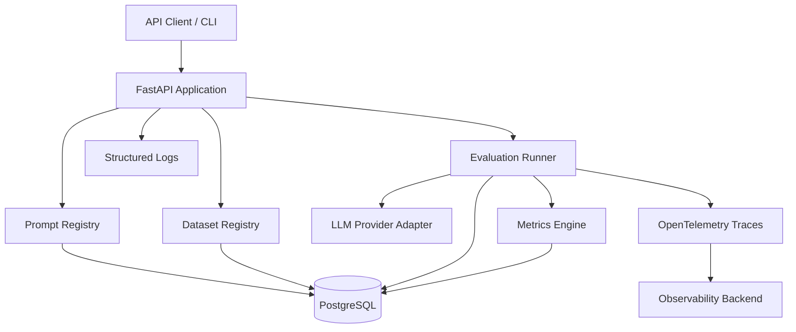
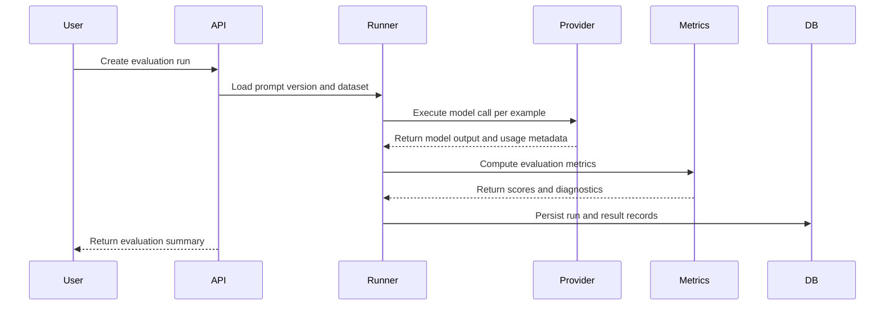

# LLM Evaluation Platform

Production-oriented platform for evaluating, monitoring, and tracing LLM workflows.

This project is designed as an AI systems engineering portfolio artifact: it focuses on the operational infrastructure required to make LLM-enabled applications measurable, reproducible, observable, and reliable.

## Problem Statement

Modern AI applications often integrate LLMs without enough evaluation, observability, or operational discipline. Teams change prompts, models, datasets, and orchestration logic without a reliable way to answer:

- Did quality improve or regress?
- Which prompt version produced this output?
- Which model is more cost-effective for this task?
- Where are hallucinations, latency spikes, or failures happening?
- Can we reproduce a previous evaluation run?
- Are LLM workflows observable enough for production use?

The goal of this platform is to provide evaluation pipelines, prompt lifecycle management, model comparison, metrics, and observability for production-grade AI systems.

## Core Capabilities

Planned capabilities include:

- Prompt registry and prompt versioning
- Dataset registry for evaluation examples
- Evaluation runner for prompt/model/dataset combinations
- Metrics engine for latency, cost, token usage, pass/fail, exact match, and semantic similarity
- LLM provider abstraction layer
- Structured logs and traceable evaluation runs
- OpenTelemetry-based observability
- Dockerized local development
- CI pipeline for tests, linting, and formatting

## System Architecture



## Evaluation Workflow



## Tech Stack

- Python
- FastAPI
- PostgreSQL
- SQLite
- SQLAlchemy / Alembic
- Pytest
- Docker / Docker Compose
- OpenTelemetry
- GitHub Actions
- Ruff

## Repository Status

This repository is currently focused on backend foundations, reproducibility, domain modeling, migration infrastructure, and evaluation architecture.

## Roadmap

- [x] Initialize repository structure
- [x] Add README, license, CI, and Docker foundation
- [x] Add FastAPI application foundation
- [x] Add Ruff quality checks
- [x] Add Docker Compose local development
- [x] Add initial modular backend structure
- [x] Add domain model architecture
- [x] Add reproducibility-focused evaluation entities
- [x] Add Alembic migration foundation
- [x] Add initial domain documentation
- [ ] Add initial database migration
- [ ] Add database bootstrap validation
- [ ] Add Pydantic schemas
- [ ] Add CRUD services
- [ ] Add prompt registry endpoints
- [ ] Add dataset registry endpoints
- [ ] Add evaluation run lifecycle
- [ ] Add LLM provider adapter layer
- [ ] Add metrics engine
- [ ] Add OpenTelemetry instrumentation
- [ ] Add structured logging and trace correlation
- [ ] Add Grafana/Prometheus observability stack

## Engineering Principles

- Build for reproducibility before scale
- Make evaluation runs traceable and auditable
- Treat prompts and models as versioned system components
- Prioritize observability and operational diagnostics
- Keep the architecture modular and provider-agnostic
- Design for production reliability, not demo-only workflows

## Local Development

```bash
docker compose up --build
```

API health check:

```bash
curl http://localhost:8000/health
```

## License

MIT License.
